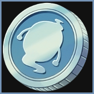

**Yo-kai Check** is a small plugin to assist you in tracking the rewards of the Yo-kai Watch event. 
 

You will not find this plugin in the official plugin repository.  
However, you're free to add my custom repository to get updates whenever I release a new version:  
https://raw.githubusercontent.com/Haselnussbomber/MyDalamudPlugins/main/repo.json

Open with `/yokai`.

---

